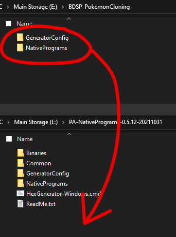
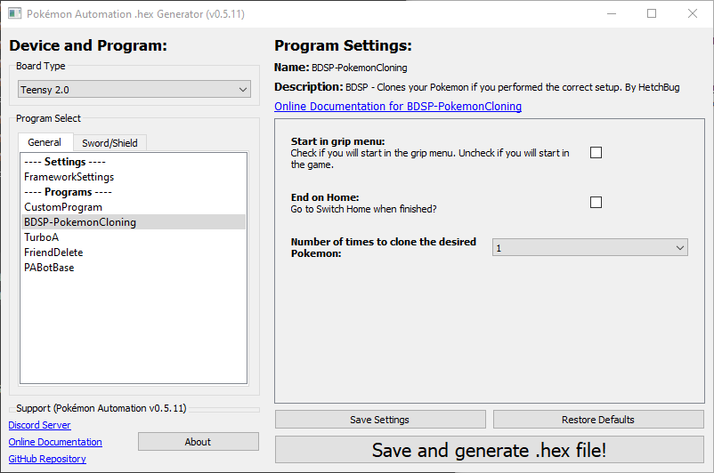
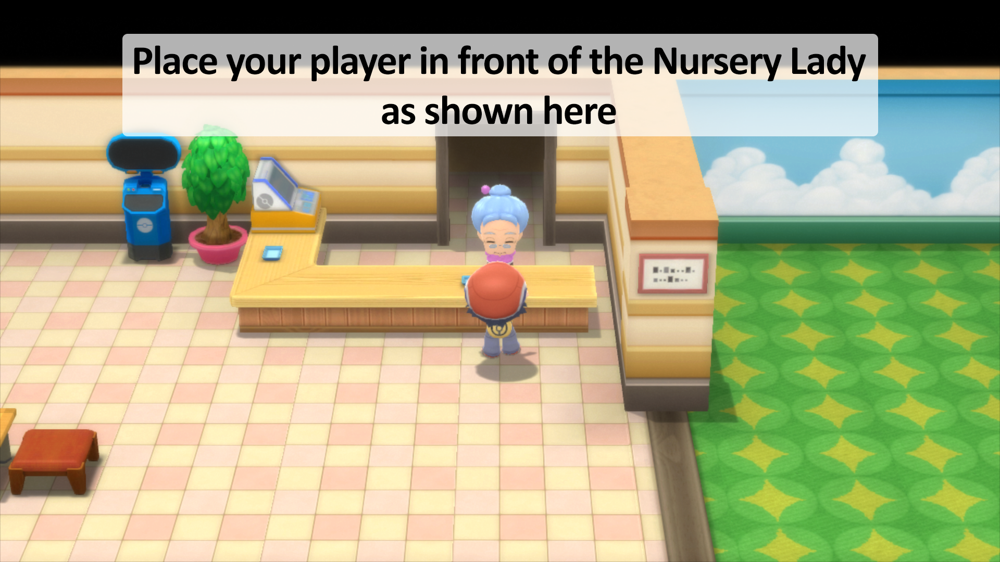
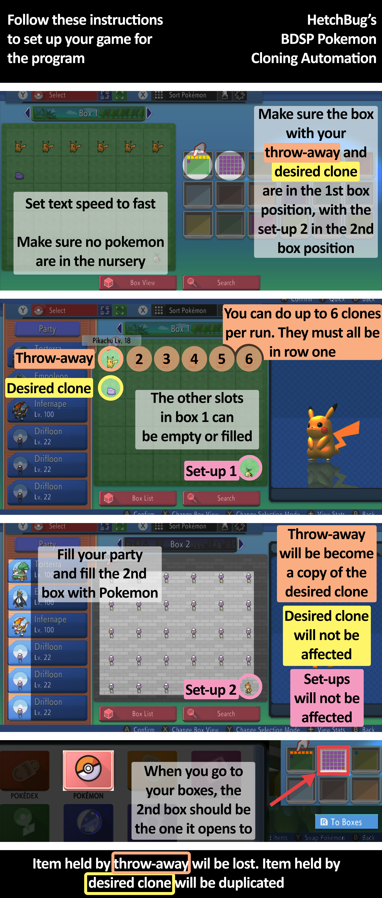

# BDSP-PokemonCloning
An automation program based on "Pokémon Automation - Microcontroller Programs" that clones Pokemon in BDSP.

This is a custom program that utilizes Pokémon Automation's Microcontroller Programs, found here: https://github.com/PokemonAutomation/Microcontroller
Thanks to all the work that team has put into making such a great utility. Just like their repo, this repo is under the MIT License.

This native microcontroller program is based on the cloning glitch in Pokemon BDSP. A video run-down of how it works can be found here: https://www.youtube.com/watch?v=iPXI3knuhkg

Credit for the glitch discovery: kevinfor5
https://twitter.com/kevinfor5/status/1462952576840880134

# Installation
To use this program you must have Pokémon Automation's Microcontroller Programs downloaded, found here: https://github.com/PokemonAutomation/Microcontroller/releases.
Download the BDSP-PokemonCloning files, found here: https://github.com/HetchBug/BDSP-PokemonCloning/releases

Then copy the two folders from this repo into your PA-NativePrograms-X.Y.Z folder and allow it to overwrite the ProgramList.txt file. If you don't do this, then this program will not show up when you try to open the hex generator.

When you open the hex generator, the program will be listed in the "General" tab as "BDSP-PokemonCloning."

# Setup
Make sure to follow the setup tutorial to make sure you setup everything correctly before running the program.

# Demo Video

